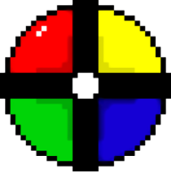

# Simons Says

Ett litet projekt som använder sig av React Hooks för att återskapa spelet "Simons säger"/"Simon Says".

Spelet skapades under en 2 timmars session av mobb programmering under en gemensam träff för studenter på utbildningen *WEBBUTVECKLARE .NET* på Yrkeshögskolan **Campus Värnamo**. Hackathonet ägde rum den 27 maj 2020.

### Kom igång och spela

Använd `npm install` för att installera alla behövda paket och `npm start` för att starta och öppna spelet i din webbläsare.

### Syftet
Syftet med hackathonet var att lära sig utveckla i stora samtida grupper (mobb programmering) och lära sig mer om att bygga webbapplikationer med React och framförallt React Hooks.

## mobb-utvecklat av WU19

 - [Roman Matvichuk ](https://github.com/RomanMatvichuk)
 - Stefan Gillsbro Carrillo
 - Aslan Khadizov
 - [Fon To ](https://github.com/fonto1)
 - [Simon Jansson](SimonJCode)
 - [Tero Viitala](https://github.com/treox)
 - [Jimmy Johansson](https://github.com/Tallbacka)
 - Vytautas Skergelza
 - Iryna Sabo
 - Nemanja Milosavljevic
 - Aleksandra Sagitova
 - Susanne Josefine Trygg
